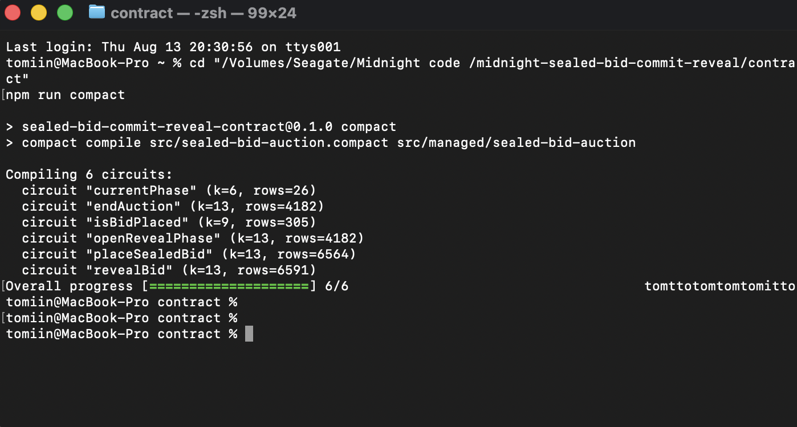
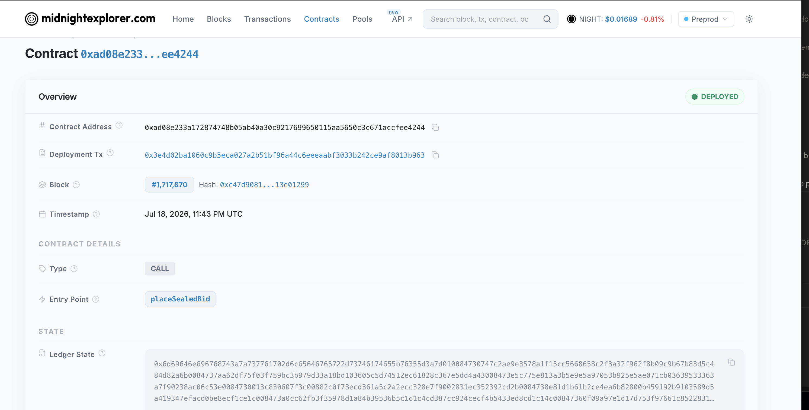

# Sealed-Bid Auction (Commit-Reveal)

A small sealed-bid auction I built on the **Midnight** network, written in
Compact. The whole point is privacy during bidding: while the auction is open,
nobody — not other bidders, not even the auctioneer — can see what anyone bid.
When bidding closes, people reveal their numbers, the contract checks each one
against what was locked in earlier, and the highest honest bid wins.

Think of it as everyone dropping a number into a sealed envelope. While the
envelopes are shut, nobody can peek. When it's time, each person opens their own
envelope, and the biggest number takes it. The clever part is that Midnight lets
the contract prove nobody swapped the paper inside their envelope after the fact.

This is a fresh take on the idea, and the thing I actually wanted to get right
this time is the **nullifier**: a one-way, per-bidder fingerprint that blocks
anyone from bidding twice without ever putting their identity on chain.

## Initial idea

Sealed-bid auctions exist because seeing other people's bids changes what you
bid. The usual fix is a trusted auctioneer who holds the envelopes and promises
not to peek, which just moves the trust rather than removing it. This contract
removes it. Bidders commit to an amount by publishing a hash, and nobody
including the auctioneer can read a bid while bidding is open. When the reveal
phase starts, each bidder opens their own envelope and the contract checks the
number against the commitment locked in earlier, so nobody can change their bid
after seeing someone else's. A per-bidder nullifier blocks a second bid from the
same identity without that identity ever reaching the chain. The natural users
are anywhere bid privacy is the whole point and a neutral auctioneer is hard to
find: procurement, spectrum and land allocation, over-the-counter asset sales,
and on-chain NFT or token auctions where mempool visibility currently lets people
snipe.

## Public state vs private witness

The split Compact forces you to make, stated plainly.

**Public ledger state** — on-chain, readable by anyone:

| field | what it is |
| --- | --- |
| `phase` | which stage the auction is in |
| `commitments` | nullifier to bid commitment, both opaque hashes |
| `revealedNullifiers` | who has revealed, as nullifiers not identities |
| `highestBid`, `highestBidder`, `hasWinner` | the outcome once revealing starts |
| `bidCount` | how many bids were placed |

**Private witnesses** — supplied by the bidder's own device, consumed inside the
proof, never written to the chain:

| witness | what it is |
| --- | --- |
| `localSecretKey()` | the bidder's identity key |
| `localBidAmount()` | the amount they are bidding |
| `localBidSalt()` | the salt that makes the commitment unguessable |

**What a bidder proves without revealing.** At commit time: that they are a
distinct bidder who has not already bid, without publishing who they are. At
reveal time: that the amount they are now claiming is the same one they
committed to earlier, without anyone having been able to read it in between.

The salt matters more than it looks. Bid amounts come from a small range, so a
commitment to the amount alone could be brute-forced by hashing every plausible
number. The salt is what makes the envelope actually opaque.

## Deployed on Midnight Preprod

This contract is live on Midnight **Preprod**:

- **Contract address:** `ad08e233a172874748b05ab40a30c9217699650115aa5650c3c671accfee4244`
- **Network:** Preprod (`rpc.preprod.midnight.network`)
- **On-chain interaction:** deployed and then exercised with a `placeSealedBid`
  call — both submitted from the CLI in [`deploy/`](deploy/).

The [`deploy/`](deploy/) folder is the deployment + interaction interface: a small
TypeScript CLI (`npm run deploy -- "<item description>"`) that builds the wallet,
proves the transaction, and submits the deploy plus the first on-chain interaction
to Preprod. Read or extend it from there.

> Deploying to Preprod can hit error 170 (`InvalidDustSpendProof`) when the wallet's
> DUST fee state is a step behind the chain tip. The deploy CLI handles it by
> *rebuilding and re-balancing* the transaction on each retry instead of resubmitting
> a stale one — the same fix I worked out building my Midnight wallet CLI.

Full deploy gotchas (error 170, stale DUST, the private-state password): [`deploy/ROADBLOCKS.md`](deploy/ROADBLOCKS.md).

## Demo

[`docs/sealed-bid-demo.mp4`](docs/sealed-bid-demo.mp4) — connecting a wallet,
joining the auction on Preprod, committing a sealed bid, revealing it, and
disconnecting.

Every action in that recording is a real transaction on Midnight Preprod. The
sealed bid from the demo is verifiable on-chain:

- **Bid transaction:** [`96c824a4…a15946`](https://explorer.1am.xyz/tx/96c824a4aab3d3fcbbab88299003290cbd921555a3e0cbdf0ba46cb8b3a15946?network=preprod)

Proofs are generated locally — in the wallet where it supports delegated
proving, otherwise against a proof server on your own machine. The bid amount
is never transmitted to anyone.

## The privacy claim

The claim this project makes is narrow and testable:

> The contract can prove that **you have already bid** without learning **who you
> are** or **what you bid**.

Here is exactly how that works, and where it stops.

Two values reach the chain when you bid:

```
commitment = persistentHash(amount, salt)            // hides the amount
nullifier  = persistentHash("sbid:v1:nullifier", sk) // identifies the bid, not you
```

Your bid amount, its salt and your secret key never leave the browser. They are
supplied to the circuit as witnesses at proving time, and the proof convinces the
network the rules were followed without revealing any of them.

**The observable behavior.** Bid once and your row appears in the public ledger
table marked `sealed`: a nullifier, a commitment, and no amount. Bid a second
time and the contract rejects it:

```
failed assert: SealedBidAuction: this nullifier has already bid
```

That rejection is the privacy claim made visible. The contract recomputed your
nullifier from your secret key, found it already present as a key in the
`commitments` map, and refused — while still holding no idea who you are and no
idea what either bid was worth. Proven, not shown.

**Domain separation.** The auctioneer's identity is derived from the same secret
key but under a different tag, `sbid:v1:owner`. Because the tags differ, the
auctioneer's on-chain id cannot be linked to their bid nullifier, even though
both come from one key.

**Where the privacy stops, honestly.** The nullifier of anyone who bids is
public, as is the fact that a bid was placed and its commitment. Once a bidder
chooses to reveal, the winning amount becomes public — that is a first-price
auction with sealed bids, not a secret tally. Anyone who never reveals keeps
their bid private permanently. Timing and transaction metadata are not hidden.

**Private state is deliberately not persisted.** The amount and salt live in
memory for the life of the tab. Reload the page between bidding and revealing
and you cannot reveal. That is the intended trade: a losing bid should not be
recoverable from your machine after the auction, so it is never written to disk.

## Wallet support

This DApp targets the Midnight **DApp Connector API**, not a particular wallet.
It enumerates every wallet injected on `window.midnight` rather than reading a
fixed key, verifies the wallet is on the network the app expects, and
feature-detects `getProvingProvider`:

- wallets that implement it (**1AM**) get **delegated proving**
- wallets that do not (**Lace**) fall back to a proof server, per Midnight's
  recommended conditional fallback

Either way the bid amount is proven locally and never sent to a third party.

**Demonstrated on 1AM on Preprod.** Lace currently fails at `connect()` with
`InternalError: "Wallet is unavailable"`, thrown from inside its own service
worker, with `apiVersion` 4.0.1 matching the pinned `@midnight-ntwrk/dapp-connector-api`
and a call shape identical to Midnight's official React connector guide. Midnight's
Aliit Fellowship publishes 1AM as the recommended Preprod setup and documents Lace
sync and authentication timeouts on that network. No code change here will be
needed when Lace catches up.

## Screenshots

The contract compiling, with every circuit's `k` and row count:



The deployed contract on the Preprod explorer:



## CI

Every push to `main` and every pull request compiles the contract and runs the
test suite. See [`.github/workflows/ci.yml`](.github/workflows/ci.yml).

The workflow compiles with `--skip-zk`. CI is answering "does this still compile
and do the circuits typecheck", and generating PLONK proving keys takes minutes
without improving that answer. Key generation belongs to the local build that
actually deploys.

## How it works (in plain English)

The auction is a little state machine with three stages: **Bidding → Reveal →
Ended**. Only the auctioneer can move it forward.

1. **Bidding.** You pick an amount. Your browser scrambles it together with a
   random secret (a "salt") into a fingerprint called a *commitment*, and only
   that fingerprint gets stored on chain. Your real number never leaves your
   device. At the same time, the contract derives your *nullifier* from your
   secret key and uses it to file your bid. If you try to bid again, you produce
   the exact same nullifier — which is already on record — so the second bid is
   rejected. One identity, one bid.
2. **Reveal.** The auctioneer closes bidding. Now anyone who bid can show their
   real number. The contract re-scrambles it and checks it matches the
   fingerprint from before, so you can't reveal a different number than the one
   you committed to. Each valid reveal that beats the current best becomes the
   new highest bid. If someone never bothers to reveal, their bid just stays
   secret forever and doesn't count.
3. **Ended.** The auctioneer closes the auction. The final highest revealed bid
   and its (pseudonymous) winner are the public result, and anyone can check them.

## The nullifier, and why it matters

Compact has no built-in "who's calling" — there's no `msg.sender`. So a caller
proves who they are by knowing a secret key that stays on their own machine. From
that key the contract derives a **nullifier**: a one-way hash that's the same
every time for the same key, but tells you nothing about the key itself.

Two details make it a *real* nullifier and not just an ID hash:

- It's **domain-separated**. The hash is tagged (`"sbid:v1:nullifier"`), so a
  bidder's auction nullifier can never be confused with any other hash built from
  the same key — including the auctioneer's identity, which uses a different tag.
- It's the **double-bid guard**. The nullifier is the key your commitment is
  filed under, so a repeat bid collides with one that's already there and bounces.

## What's private, and what isn't (the honest part)

I think most "private auction" demos gloss over this, so:

- **Private:** every bid amount while bidding is open, and any bid that's never
  revealed. Your secret key is never disclosed.
- **Public:** the nullifier of anyone who bids, the commitments, and — once
  someone reveals — their winning amount and winning nullifier.

So this is a first-price auction with **private bids and one-bid-per-identity**,
not a fully secret tally. A design where even the winning amount stays hidden is
a bigger, different animal.

## What's in here

- **`contract/`** — the actual Compact smart contract, its TypeScript witnesses,
  and a Vitest suite that runs the whole thing start to finish (place sealed
  bids, open reveal, reveal out of order, pick the winner, reject double bids and
  bad reveals). This is the real heart of the project.
- **`frontend/`** — a small React page that runs the same commit-reveal logic
  right in the browser, so you can click through the full experience — place
  secret bids, reveal them, watch the winner update — without setting up a wallet
  or a node. There's a clearly marked seam (`frontend/src/auction/midnightClient.ts`)
  for wiring the same UI to a live on-chain deployment.

## Running it

You'll need [Node.js](https://nodejs.org) (I used version 24) and Midnight's
Compact toolchain (`compact`). See the
[Midnight docs](https://docs.midnight.network) for installing the compiler.

**Contract — compile and test:**

```bash
cd contract
npm install
npm run compact     # compiles the Compact contract (full ZK keys)
npm test            # runs the Vitest suite against the compiled contract
```

**Frontend — play with it in the browser:**

```bash
cd frontend
npm install
npm run dev         # then open http://localhost:5173
```

## Going on-chain

The frontend talks to a single `AuctionClient` interface. The bundled version
runs everything locally so the demo needs no setup. To run the identical UI
against a real deployment, implement that interface against the compiled contract
and Midnight providers — the steps are written out at the top of
`frontend/src/auction/midnightClient.ts`.

## Attribution

This project is built on and for the **[Midnight](https://midnight.network)**
network, using the **[Compact](https://docs.midnight.network)** smart-contract
language. The contract package layout and the in-memory test harness follow the
conventions of the Midnight example projects and the Edda Labs contract template.

## License

Apache-2.0 — see [LICENSE](./LICENSE).
